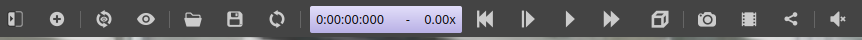
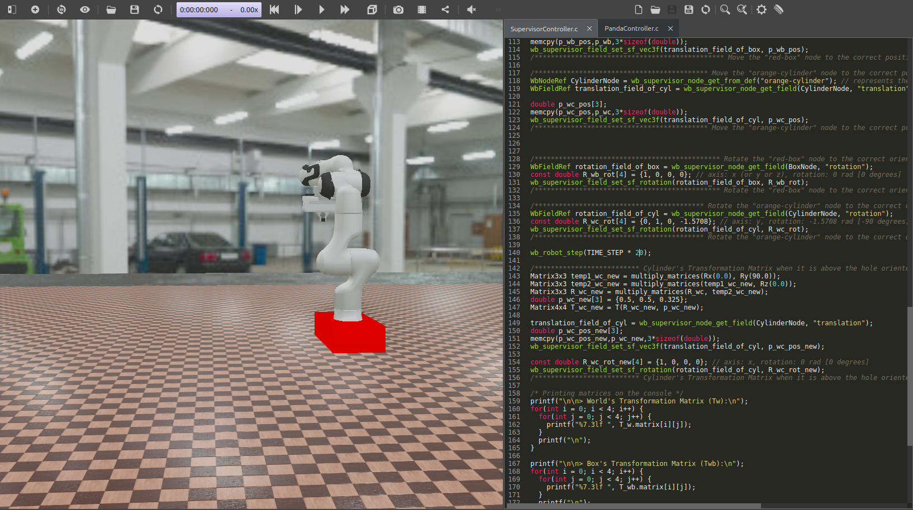
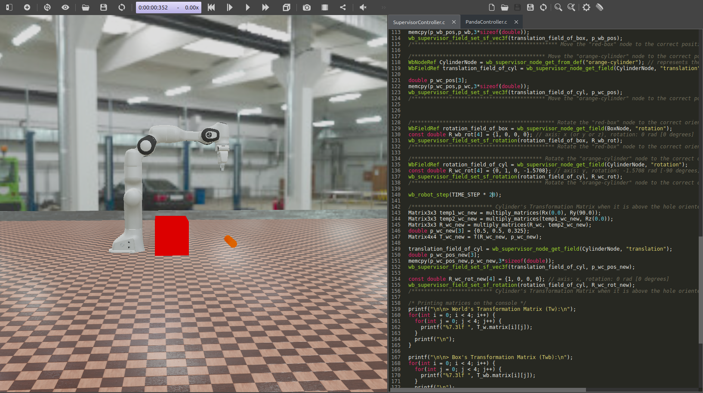
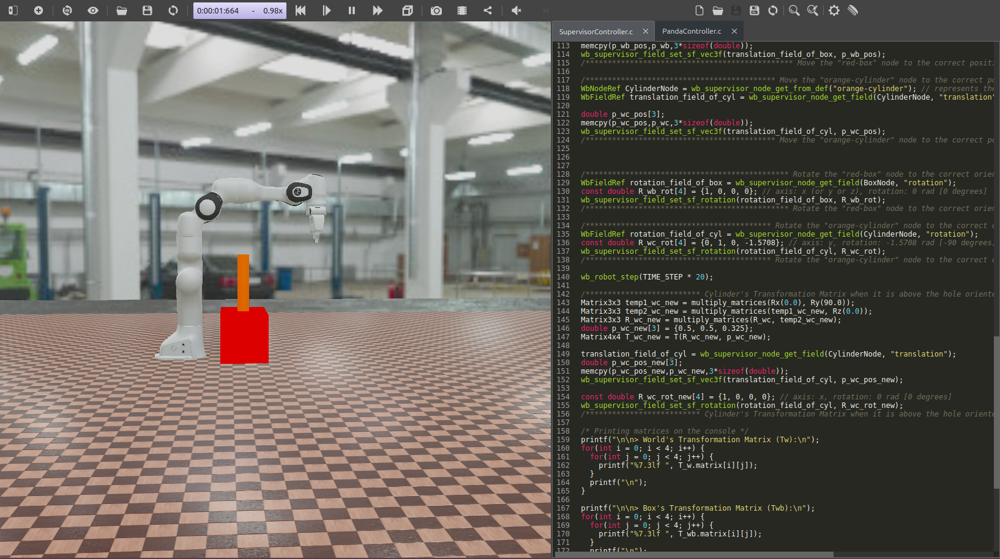

# Installation and Use of Webots

## Installation of Webots for Linux
Installation can be done by following the official Cyberbotics instructions: [Installing the Debian Package with the Advanced Packaging Tool (APT)](https://cyberbotics.com/doc/guide/installation-procedure#installing-the-debian-package-with-the-advanced-packaging-tool-apt)

Alternatively, install the `.deb` file directly using the terminal:

```bash
sudo apt install ./webots_2023b_amd64.deb
```
---

## Opening the World and Starting Simulation
Open the world file:

`File > Open World > homeworks/homework-1/homework_1/worlds/homework_1.wbt`

To view controllers' code:

`Tools > Text Editor`

If `SupervisorController.c` and `PandaController.c` are not open, open them using the folder icon inside the Text Editor and navigate to:

* `homeworks/homework-1/homework_1/controllers/PandaController.c`

* `homeworks/homework-1/homework_1/controllers/SupervisorController.c`

---

## Compiling Controllers
If something changes in controllers, open two terminals and run:

Terminal 1:
```bash
cd homeworks/homework-1/homework_1/controllers/SupervisorController
make clean; make
```

Terminal 2:
```bash
cd homeworks/homework-1/homework_1/controllers/PandaController
make clean; make
```

---

## Running Simulation
To start the simulation, press the **Play** (start arrow) button at the top of the Webots interface.



---

## Simulation Description
When the world is first opened, all objects (robot arm, box, cylinder) are located at position (0,0,0) and oriented according to the world reference frame.



When simulation starts, all objects move to their predefined positions. The box and cylinder move to the positions defined in the assignment, and the robot arm moves to the position obtained during problem solving.



A few seconds after reaching their positions, the cylinder changes its position and orientation and moves to the correct location so that when it is released from the robot gripper, it falls inside the hole of the red box.



Transformation matrices of the objects are printed in the console, showing their orientation in the world frame.
